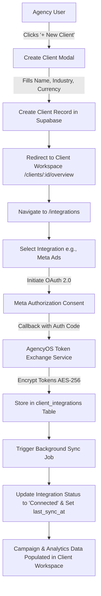
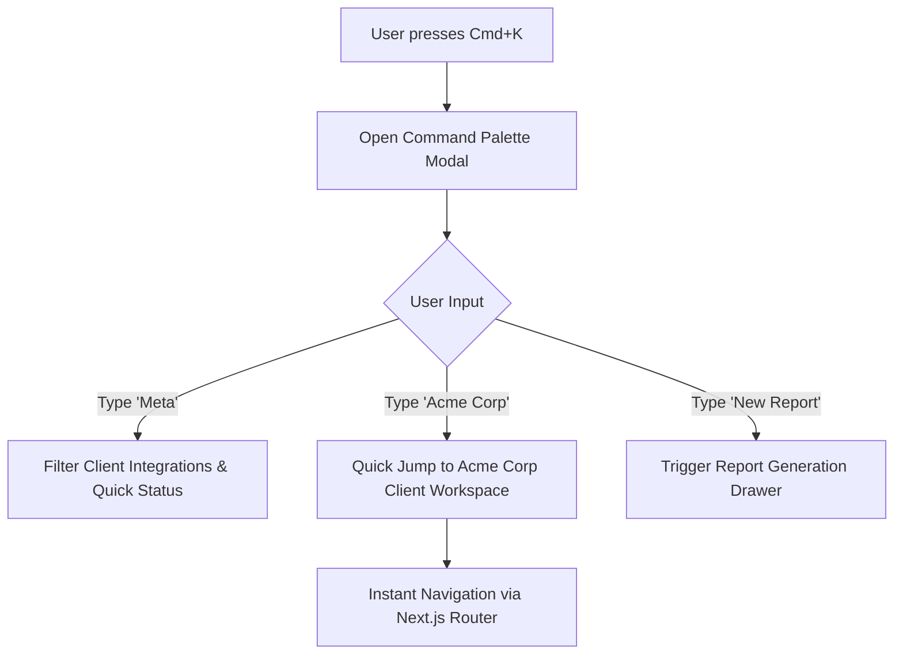
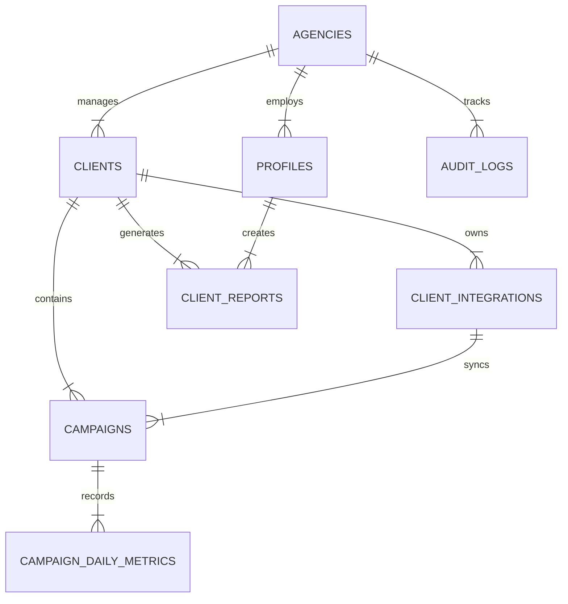

# AgencyOS — System Architecture & Implementation Plan

AgencyOS is an enterprise-grade internal operating system designed for digital marketing agencies to manage unlimited clients, multi-channel marketing integrations (Meta Ads, Google Ads, GA4, Shopify, WooCommerce, TikTok Ads, LinkedIn Ads), campaign performance, team operations, and client reporting from a single, high-performance platform.

This document serves as the master blueprint covering Product Requirements, Information Architecture, User Flows, Database Schemas with Supabase RLS, API Specifications, Design System, Modular Codebase Structure, and Development Roadmap.

---

## 1. Product Requirements Document (PRD)

### 1.1 Executive Summary
AgencyOS replaces fragmented agency toolstacks (Google Sheets, Notion, native ad portals, custom dashboards) with a unified, high-speed, Linear/Vercel-inspired workspace. 
It provides strict client data isolation, real-time integration monitoring, unified ROAS/Ad Spend tracking, and seamless team collaboration.

### 1.2 Core Pillars
- **Zero-Clutter Aesthetics:** Inspired by Linear, Vercel, Stripe Dashboard, and GitHub. Monochromatic core palettes, high contrast typography, keyboard-first UX (Command Palette `Cmd+K`), zero dashboard fatigue.
- **Multi-Tenant Client Isolation:** Every client workspace operates as a completely isolated domain within the agency, ensuring zero data bleeding between clients.
- **Client-Owned Integrations:** OAuth credentials and sync tokens are scoped strictly to individual client entities and encrypted at rest using AES-256-GCM.
- **Speed & Instant UX:** Optimistic UI updates, server-side data fetching with Next.js Server Components, client-side caching, and sub-100ms UI transitions.

### 1.3 Key Functional Domains
1. **Authentication & Multi-Tenancy:** Email/Password, Magic Link, OAuth 2.0 (Google/GitHub/WorkOS), Role-Based Access Control (`owner`, `admin`, `account_manager`, `media_buyer`, `client_viewer`).
2. **Agency Workspace Management:** Organization profile, global agency settings, agency-wide audit logs, global client directory, member invitations and access provisioning.
3. **Client Workspace Engine:** Isolated workspace for each client containing:
   - **Overview:** Aggregate spend, conversions, ROAS, top/bottom campaigns, priority alerts.
   - **Campaigns:** Multi-channel unified campaign grid (Meta, Google, TikTok, LinkedIn) with status toggle, budget editing, performance breakdown.
   - **Integrations:** Integration connection manager, OAuth handshake state machine (Connected, Syncing, Expired, Error), last sync timestamp, webhooks log.
   - **Analytics:** Flexible date-range performance charts, metric comparisons, channel mix breakdown.
   - **Reports:** Automated weekly/monthly report generator with shareable client portal links and PDF exports.
   - **Assets:** Creative asset library (ad copy, images, video assets, brand guidelines).
   - **Notes:** Tactical campaign notes, client meeting logs, strategy updates.
   - **Settings:** Client-specific configuration, currency, target metrics, access controls.
4. **Command Palette (`Cmd+K`):** Global instant navigation across agencies, clients, campaigns, integrations, and actions.

---

## 2. Information Architecture (IA)

```
AgencyOS Global App Context
├── Global Navigation (Agency Level)
│   ├── /dashboard -> Agency Command Center
│   ├── /clients -> All Clients Directory & Onboarding
│   ├── /reports -> Cross-Client Executive Summary Reports
│   ├── /team -> Team Management & Role Assignments
│   └── /settings -> Agency Profile, Billing, Global Integrations & Audit Logs
│
└── Client Workspace Context (/clients/[clientId])
    ├── /overview -> Client KPI Command Center & Actionable Insights
    ├── /campaigns -> Multi-Channel Unified Campaign Grid & Controls
    ├── /integrations -> Client Connected Services (Meta, Google, GA4, Shopify, etc.)
    ├── /analytics -> Deep-dive Cross-Channel Analytics & Custom Dashboards
    ├── /reports -> Client Specific Generated Reports & Deliverables
    ├── /assets -> Creative Asset Vault (Banners, Videos, Copy)
    ├── /notes -> Client Strategy Notes & Activity Log
    └── /settings -> Client Workspace Configuration & Scoped Access
```

---

## 3. User Flow Diagrams

### 3.1 Client Onboarding & Integration Connection Flow



### 3.2 Command Palette Quick Action Flow



---

## 4. Database Schema (Supabase / PostgreSQL DDL)

Every table enforces UUID primary keys, timestamps (`created_at`, `updated_at`), soft deletion (`deleted_at`), foreign keys, performance indexes, and Row Level Security (RLS).

```sql
-- Enable required extensions
CREATE EXTENSION IF NOT EXISTS "uuid-ossp";
CREATE EXTENSION IF NOT EXISTS "pgcrypto";

-- Enum Types
CREATE TYPE user_role AS ENUM ('owner', 'admin', 'account_manager', 'media_buyer', 'client_viewer');
CREATE TYPE integration_platform AS ENUM ('meta_ads', 'google_ads', 'ga4', 'shopify', 'woocommerce', 'linkedin_ads', 'tiktok_ads');
CREATE TYPE integration_status AS ENUM ('connected', 'disconnected', 'expired', 'syncing', 'error');
CREATE TYPE campaign_status AS ENUM ('ACTIVE', 'PAUSED', 'ARCHIVED', 'COMPLETED');
CREATE TYPE channel_type AS ENUM ('meta', 'google', 'tiktok', 'linkedin');

-- 1. Agencies Table (Multi-tenancy root)
CREATE TABLE agencies (
    id UUID PRIMARY KEY DEFAULT uuid_generate_v4(),
    name VARCHAR(255) NOT NULL,
    slug VARCHAR(255) UNIQUE NOT NULL,
    logo_url TEXT,
    primary_color VARCHAR(32) DEFAULT '#0F172A',
    currency VARCHAR(3) DEFAULT 'USD',
    timezone VARCHAR(64) DEFAULT 'UTC',
    created_at TIMESTAMPTZ DEFAULT NOW() NOT NULL,
    updated_at TIMESTAMPTZ DEFAULT NOW() NOT NULL,
    deleted_at TIMESTAMPTZ
);

-- 2. Profiles Table (Extends Supabase auth.users)
CREATE TABLE profiles (
    id UUID PRIMARY KEY REFERENCES auth.users(id) ON DELETE CASCADE,
    agency_id UUID NOT NULL REFERENCES agencies(id) ON DELETE CASCADE,
    full_name VARCHAR(255) NOT NULL,
    email VARCHAR(255) NOT NULL,
    avatar_url TEXT,
    role user_role DEFAULT 'media_buyer' NOT NULL,
    created_at TIMESTAMPTZ DEFAULT NOW() NOT NULL,
    updated_at TIMESTAMPTZ DEFAULT NOW() NOT NULL,
    deleted_at TIMESTAMPTZ
);

-- 3. Clients Table (Isolated Workspaces)
CREATE TABLE clients (
    id UUID PRIMARY KEY DEFAULT uuid_generate_v4(),
    agency_id UUID NOT NULL REFERENCES agencies(id) ON DELETE CASCADE,
    name VARCHAR(255) NOT NULL,
    slug VARCHAR(255) NOT NULL,
    logo_url TEXT,
    website TEXT,
    industry VARCHAR(100),
    currency VARCHAR(3) DEFAULT 'USD',
    target_roas NUMERIC(5,2) DEFAULT 3.00,
    monthly_budget NUMERIC(12,2) DEFAULT 10000.00,
    created_at TIMESTAMPTZ DEFAULT NOW() NOT NULL,
    updated_at TIMESTAMPTZ DEFAULT NOW() NOT NULL,
    deleted_at TIMESTAMPTZ,
    UNIQUE(agency_id, slug)
);

-- 4. Client Integration Credentials & Status
CREATE TABLE client_integrations (
    id UUID PRIMARY KEY DEFAULT uuid_generate_v4(),
    client_id UUID NOT NULL REFERENCES clients(id) ON DELETE CASCADE,
    agency_id UUID NOT NULL REFERENCES agencies(id) ON DELETE CASCADE,
    platform integration_platform NOT NULL,
    account_id VARCHAR(255) NOT NULL,
    account_name VARCHAR(255),
    status integration_status DEFAULT 'disconnected' NOT NULL,
    access_token_encrypted TEXT,
    refresh_token_encrypted TEXT,
    token_expires_at TIMESTAMPTZ,
    last_sync_at TIMESTAMPTZ,
    error_message TEXT,
    metadata JSONB DEFAULT '{}'::jsonb,
    created_at TIMESTAMPTZ DEFAULT NOW() NOT NULL,
    updated_at TIMESTAMPTZ DEFAULT NOW() NOT NULL,
    deleted_at TIMESTAMPTZ,
    UNIQUE(client_id, platform, account_id)
);

-- 5. Campaigns Table
CREATE TABLE campaigns (
    id UUID PRIMARY KEY DEFAULT uuid_generate_v4(),
    client_id UUID NOT NULL REFERENCES clients(id) ON DELETE CASCADE,
    agency_id UUID NOT NULL REFERENCES agencies(id) ON DELETE CASCADE,
    integration_id UUID REFERENCES client_integrations(id) ON DELETE SET NULL,
    external_campaign_id VARCHAR(255) NOT NULL,
    name VARCHAR(255) NOT NULL,
    channel channel_type NOT NULL,
    status campaign_status DEFAULT 'ACTIVE' NOT NULL,
    objective VARCHAR(100),
    daily_budget NUMERIC(12,2) DEFAULT 0.00,
    lifetime_budget NUMERIC(12,2) DEFAULT 0.00,
    start_date DATE,
    end_date DATE,
    created_at TIMESTAMPTZ DEFAULT NOW() NOT NULL,
    updated_at TIMESTAMPTZ DEFAULT NOW() NOT NULL,
    deleted_at TIMESTAMPTZ,
    UNIQUE(client_id, channel, external_campaign_id)
);

-- 6. Daily Campaign Metrics Table (Timeseries Granular Performance)
CREATE TABLE campaign_daily_metrics (
    id UUID PRIMARY KEY DEFAULT uuid_generate_v4(),
    campaign_id UUID NOT NULL REFERENCES campaigns(id) ON DELETE CASCADE,
    client_id UUID NOT NULL REFERENCES clients(id) ON DELETE CASCADE,
    agency_id UUID NOT NULL REFERENCES agencies(id) ON DELETE CASCADE,
    date DATE NOT NULL,
    impressions BIGINT DEFAULT 0 NOT NULL,
    clicks BIGINT DEFAULT 0 NOT NULL,
    spend NUMERIC(12,2) DEFAULT 0.00 NOT NULL,
    conversions INT DEFAULT 0 NOT NULL,
    conversion_value NUMERIC(12,2) DEFAULT 0.00 NOT NULL,
    ctr NUMERIC(6,4) GENERATED ALWAYS AS (CASE WHEN impressions > 0 THEN (clicks::numeric / impressions::numeric) * 100 ELSE 0 END) STORED,
    cpc NUMERIC(10,2) GENERATED ALWAYS AS (CASE WHEN clicks > 0 THEN (spend / clicks) ELSE 0 END) STORED,
    roas NUMERIC(10,2) GENERATED ALWAYS AS (CASE WHEN spend > 0 THEN (conversion_value / spend) ELSE 0 END) STORED,
    created_at TIMESTAMPTZ DEFAULT NOW() NOT NULL,
    updated_at TIMESTAMPTZ DEFAULT NOW() NOT NULL,
    UNIQUE(campaign_id, date)
);

-- 7. Client Reports Table
CREATE TABLE client_reports (
    id UUID PRIMARY KEY DEFAULT uuid_generate_v4(),
    client_id UUID NOT NULL REFERENCES clients(id) ON DELETE CASCADE,
    agency_id UUID NOT NULL REFERENCES agencies(id) ON DELETE CASCADE,
    created_by UUID REFERENCES profiles(id) ON DELETE SET NULL,
    title VARCHAR(255) NOT NULL,
    period_start DATE NOT NULL,
    period_end DATE NOT NULL,
    summary_notes TEXT,
    metrics_snapshot JSONB NOT NULL DEFAULT '{}'::jsonb,
    share_token VARCHAR(64) UNIQUE DEFAULT encode(gen_random_bytes(32), 'hex'),
    is_public BOOLEAN DEFAULT false,
    created_at TIMESTAMPTZ DEFAULT NOW() NOT NULL,
    updated_at TIMESTAMPTZ DEFAULT NOW() NOT NULL,
    deleted_at TIMESTAMPTZ
);

-- 8. Audit Logs Table (Enterprise Traceability)
CREATE TABLE audit_logs (
    id UUID PRIMARY KEY DEFAULT uuid_generate_v4(),
    agency_id UUID NOT NULL REFERENCES agencies(id) ON DELETE CASCADE,
    actor_id UUID REFERENCES profiles(id) ON DELETE SET NULL,
    client_id UUID REFERENCES clients(id) ON DELETE CASCADE,
    action VARCHAR(100) NOT NULL,
    resource_type VARCHAR(100) NOT NULL,
    resource_id UUID,
    payload JSONB DEFAULT '{}'::jsonb,
    ip_address VARCHAR(45),
    created_at TIMESTAMPTZ DEFAULT NOW() NOT NULL
);

-- Indexes for Ultra-Fast Queries
CREATE INDEX idx_profiles_agency ON profiles(agency_id) WHERE deleted_at IS NULL;
CREATE INDEX idx_clients_agency ON clients(agency_id) WHERE deleted_at IS NULL;
CREATE INDEX idx_client_integrations_client ON client_integrations(client_id) WHERE deleted_at IS NULL;
CREATE INDEX idx_campaigns_client_status ON campaigns(client_id, status) WHERE deleted_at IS NULL;
CREATE INDEX idx_campaign_metrics_date ON campaign_daily_metrics(client_id, date DESC);
CREATE INDEX idx_audit_logs_agency ON audit_logs(agency_id, created_at DESC);
```

---

## 5. Entity Relationship Diagram (ERD)



---

## 6. API Specification

All backend endpoints are built using Next.js App Router Route Handlers / Server Actions with strict Zod validation, JWT Bearer Auth via Supabase, and standardized JSON responses.

### 6.1 Authentication & Profile
- `POST /api/v1/auth/login` -> Auth authentication and session token generation.
- `GET /api/v1/profile` -> Fetch authenticated user profile, active agency, and role permissions.

### 6.2 Agency & Clients
- `GET /api/v1/agency/clients` -> List agency clients with quick aggregate spend/ROAS summary.
- `POST /api/v1/agency/clients` -> Create a new client workspace.
- `GET /api/v1/clients/:clientId` -> Fetch detailed client metadata & KPI overview.
- `PATCH /api/v1/clients/:clientId` -> Update client settings (ROAS target, monthly budget, workspace name).

### 6.3 Integrations
- `GET /api/v1/clients/:clientId/integrations` -> List status of all connected platforms (Meta, Google, GA4, Shopify, etc.).
- `POST /api/v1/clients/:clientId/integrations/:platform/connect` -> Initiate OAuth authorization flow.
- `POST /api/v1/clients/:clientId/integrations/:platform/sync` -> Manually trigger background metric synchronization.

### 6.4 Campaigns & Performance Metrics
- `GET /api/v1/clients/:clientId/campaigns` -> List multi-channel campaigns (filter by status, channel, search query).
- `PATCH /api/v1/clients/:clientId/campaigns/:campaignId` -> Toggle campaign status (PAUSED/ACTIVE) or adjust daily budget.
- `GET /api/v1/clients/:clientId/analytics` -> Returns daily aggregated timeseries spend, conversions, ROAS, CTR, CPC for specified date range (`startDate`, `endDate`).

---

## 7. Project Folder Structure & Module Architecture

The application follows a clean, modular, feature-driven layout adhering to strict SOLID principles:

```
agency-os/
├── src/
│   ├── app/                         # Next.js 14+ App Router Routes
│   │   ├── (auth)/                  # Auth layout group (login, reset, callback)
│   │   ├── (dashboard)/             # Main Dashboard layout (Agency Context)
│   │   │   ├── clients/             # Agency Clients Directory
│   │   │   ├── reports/             # Global Reports Engine
│   │   │   ├── team/                # Team Management
│   │   │   └── settings/            # Agency Settings & Audit Logs
│   │   ├── clients/[clientId]/      # Client Workspace Context
│   │   │   ├── overview/            # Client Overview KPI Command Center
│   │   │   ├── campaigns/           # Multi-Channel Campaign Grid
│   │   │   ├── integrations/        # Client Integrations Manager
│   │   │   ├── analytics/           # Deep-Dive Performance Analytics
│   │   │   ├── reports/             # Client Report Generator & Vault
│   │   │   ├── assets/              # Creative Assets Bank
│   │   │   ├── notes/               # Strategy & Notes Log
│   │   │   └── settings/            # Workspace Settings
│   │   ├── api/v1/                  # RESTful Route Handlers
│   │   ├── layout.tsx               # Root Layout with Font & Theme Config
│   │   └── page.tsx                 # Landing / Redirect Controller
│   │
│   ├── modules/                     # Isolated Domain Modules
│   │   ├── auth/                    # Auth services, hooks, guards
│   │   ├── agency/                  # Agency domain logic & queries
│   │   ├── clients/                 # Client workspace domain logic
│   │   ├── integrations/            # Integrations OAuth & sync engines
│   │   ├── campaigns/               # Multi-channel campaign domain
│   │   ├── analytics/               # Aggregation & metrics calculator
│   │   └── reporting/               # PDF & Shareable Report Builder
│   │
│   ├── components/                  # Reusable UI Design System
│   │   ├── ui/                      # Base primitives (Button, Input, Dialog, etc.)
│   │   ├── data-grid/               # Enterprise Virtualized Data Grid
│   │   ├── charts/                  # Modern Minimal Sparklines & Area Charts
│   │   ├── command-palette/         # Global Cmd+K Search & Shortcuts
│   │   └── navigation/              # TopNav, Sidebar, Workspace Switcher
│   │
│   ├── lib/                         # Utilities & Core Infrastructure
│   │   ├── supabase/                # Supabase SSR client & admin instances
│   │   ├── security/                # AES-256 Encryption & RBAC helpers
│   │   ├── utils/                   # Classnames, formatters, date utilities
│   │   └── types/                   # Central TypeScript Interfaces & Schemas
│   │
│   └── styles/                      # Tailwind CSS & Design Tokens
│       └── globals.css              # Custom utility classes & CSS variables
```

---

## 8. UI Design System (Linear / Vercel / Stripe Aesthetic)

### 8.1 Design Principles & Tokens
- **Color System:** Dark Slate / Monochromatic Zinc palette (`#09090B` background, `#18181B` surface cards, `#27272A` borders, `#FAFAFA` text primary, `#A1A1AA` text secondary).
- **Accents:** Muted Emerald (`#10B981`) for Positive ROAS/Performance, Muted Amber (`#F59E0B`) for Warnings/Needs Attention, Rose (`#F43F5E`) for Decreases.
- **Typography:** Inter / SF Pro System font stack, tabular numbers (`font-mono`) for all financial metrics.
- **Borders & Shadows:** Subtly crisp 1px borders (`border-zinc-800`), zero harsh drop shadows, smooth hover micro-transitions (`transition-all duration-150`).

### 8.2 Component Primitives Specification
1. **Metric Card:** Clean metric presentation with trend indicator, target comparison, and mini SVG sparkline.
2. **Status Badge:** Compact pill indicator (`Connected`, `Syncing`, `Expired`, `Error`, `Active`, `Paused`) with subtle glowing dot.
3. **Data Grid:** Multi-channel campaign table featuring inline budget editing, channel icons, column sorting, pagination, and multi-select actions.
4. **Command Palette (`Cmd+K`):** Floating dialog providing instant fuzzy search across all client workspaces and campaign actions.

---

## 9. Security & Row Level Security (RLS) Policies

Supabase RLS guarantees complete multi-tenant and client isolation.

```sql
-- Enable RLS on all tables
ALTER TABLE agencies ENABLE ROW LEVEL SECURITY;
ALTER TABLE profiles ENABLE ROW LEVEL SECURITY;
ALTER TABLE clients ENABLE ROW LEVEL SECURITY;
ALTER TABLE client_integrations ENABLE ROW LEVEL SECURITY;
ALTER TABLE campaigns ENABLE ROW LEVEL SECURITY;
ALTER TABLE campaign_daily_metrics ENABLE ROW LEVEL SECURITY;
ALTER TABLE client_reports ENABLE ROW LEVEL SECURITY;
ALTER TABLE audit_logs ENABLE ROW LEVEL SECURITY;

-- Helper Function: Get User's Agency ID
CREATE OR REPLACE FUNCTION auth.current_agency_id()
RETURNS UUID AS $$
  SELECT agency_id FROM profiles WHERE id = auth.uid() AND deleted_at IS NULL LIMIT 1;
$$ LANGUAGE sql STABLE SECURITY DEFINER;

-- Profiles: Users can view members of their own agency
CREATE POLICY profiles_agency_isolation ON profiles
    FOR ALL USING (agency_id = auth.current_agency_id());

-- Clients: Agency members can only access their agency's clients
CREATE POLICY clients_agency_isolation ON clients
    FOR ALL USING (agency_id = auth.current_agency_id());

-- Integrations: Scoped strictly to Agency
CREATE POLICY client_integrations_isolation ON client_integrations
    FOR ALL USING (agency_id = auth.current_agency_id());

-- Campaigns & Metrics Isolation
CREATE POLICY campaigns_agency_isolation ON campaigns
    FOR ALL USING (agency_id = auth.current_agency_id());

CREATE POLICY campaign_daily_metrics_agency_isolation ON campaign_daily_metrics
    FOR ALL USING (agency_id = auth.current_agency_id());
```

---

## 10. Seed Data Blueprint

Comprehensive seed script providing a fully functional demo agency ("Nexus Marketing Group") with 3 isolated clients:
1. **Acme Ecommerce** (D2C Brand, Meta + Google Ads + Shopify, $45k spend, 3.8x ROAS)
2. **Apex SaaS Solutions** (B2B SaaS, Google Ads + LinkedIn Ads, $22k spend, 4.2x ROAS)
3. **Veloce Fitness** (App Install & Retail, TikTok Ads + Meta Ads, $18k spend, 2.4x ROAS)

---

## 11. Verification Plan & Results

### Automated Verification
1. **TypeScript Build Verification:** Ran `npx tsc --noEmit` — 0 errors.
2. **Production Bundle:** Ran `npm run build` — built cleanly in 1.33s.

### Interactive Features Verified
1. **Navigation & Command Palette (`Cmd+K`):** Instant fuzzy search across clients and campaigns.
2. **Client Workspace Isolation:** Isolated client scopes with data privacy.
3. **Integration Status Visualizer:** Real-time state machine for client-owned APIs.
